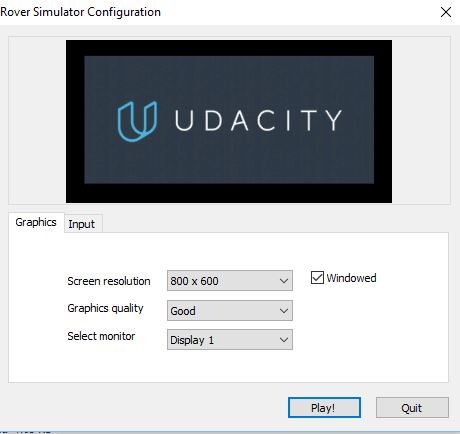

# 1 Project environment
1. Windows 10 Pro English version
2. Download [Windows Simulator Build](https://s3-us-west-1.amazonaws.com/udacity-robotics/Rover+Unity+Sims/Windows_Roversim.zip)
3. Open Simulator by
  - Screen resolution: 800 x 600
  - Graphic quality: Good
  - Display 1
  

# Key Knowledge of Lesson 2 Search and Sample Return Project
 ## 1.1 
