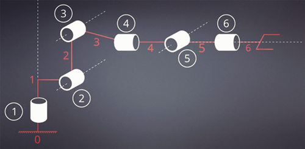
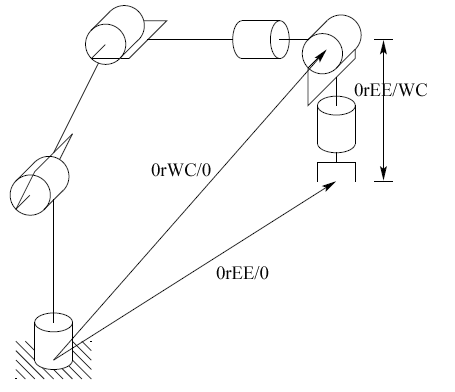

Writeup Report for RoboND - L.4. Kinematics - Robotic Arm: Pick & Place  

By: David, Dong  
Udacity username: david.dong@psi-maker.com  
Date: Oct. 28, 2017  
Location: Beijing, China  

***
#  ROS & simulation tools
1) **ROS system** http://wiki.ros.org : provides libraries and tools to help software developers create robot applications; provides hardware abstraction, device drivers, libraries, visualizers, message-passing, package management, etc.
  > * Node - the small cell unit is responsible for specific portion of overall function. ROS master manage all nodes by parameter server  
  > * Topic - share data between nodes, topic contains message data. this is the pub-sub architecture  
  > * Requst & Response - another communication method by nodes    
    
  > - VMware Workstaion 14 Player
  > - ROS virtual machine with 8GB RAM (Ubuntu 16.04 LTS) - 'Ubuntu 64-bit Robo V2.1.0-disk1.vmdk’
  > - git clone https://github.com/udacity/RoboND-Kinematics-Project.git under src folder of virtual machine

  
2) ** Gazebo** : physics based high fidelity 3D simulator for robotics. Gazebo provides the ability to accurately simulate one or more robots in complex indoor and outdoor environments filled with static and dynamic objects, realistic lighting, and programmable interactions.  
3) **RViz (or rviz）** ： stands for ROS Visualization tool or ROS Visualizer. RViz is our one stop tool to visualize all three core aspects of a robot: Perception, Decision Making, and Actuation.  
4) **MoveIt** ：an advanced motion planning framework for manipulation, kinematics, and control. It provides a platform for developing advanced robotics applications, evaluating new robot designs and building integrated robotics products for industrial, commercial, R&D, and other domains.  
***  

# Kinematics knowledge conclusion

**Kinematics** is mechanical activities without considering the force.  
  > Concepts
  >> * "Degrees of Freedom" (DoF) - the minimum number of variables that are required to define the position or configuration of a mechanism in space
  >> * Generalized coordinates - the parameters that describe the configuration of the system relative to some reference configuration
  >> * Joint types - lower order pairs & higher order pairs
  >> * Workspace - the set of all points reachable by the end effector and is a primary design constraint when selecting a manipulator for a task. 
  >>> reachable workspace  
  >>> dextrous workspace, the set of all points reachable by the end effector with an arbitrary orientation. The dextrous workspace is a subset of the reachable workspace.
  >> * Davenport chained rotations - three chained intrinsic rotations about body-fixed specific axes. Euler rotations and Tait–Bryan rotations are particular cases of the Davenport general rotation decomposition
  >> * Gimbal lock - Singularities of representation occur when the second rotation in the sequence is such that the first and third coordinate frames become aligned causing a loss of a degree of freedom. (** by quaternion rotation-the homogeneous transformation, we can avoid gimbal lock**)
    >>>q = ((x, y, z)，w) = (v, w)，v is vector, w is real number
  >> * Extrinsic/fixed coordinates & Intrinsic rotation/changed coordinates with body
  >> * Law of cosines : https://en.wikipedia.org/wiki/Law_of_cosines $a^2$ = $b^2$ + $c^2$ -2b*c*$cos(\beta)$ 
  
  > Methodology
  >> * Vector - Mathematical quantity with magnitude & direction
  >> * Matrix - used for mathematical calculation. 
  >> * Trigonometry
  >> * Denavit-Hartenberg Parameters, the DH parameters table
  >> * URDF file -  an XML format used in ROS for representing a robot model
  >> * Derivative(导数), partial derivative(偏导数), Jacobian matrix,calculus(微积分)   
 
  
  >Python packages for calculation
  >> * Sympy - Calculate matrix etc
  >> * mpmath  
***    

# Forward kinematic 
** To calculate the pose of the end-effector of Kuka KR210 given all the joint angles**

## Forward Kinematics analysis

### DH framework assignment 
Descript the DH coordinate as below(*refer to 'DH Parameter Assignment Algorithm' and 'The convention described in John J Craig's book'*):    
 >step 1. Label all joints from {1, 2, … , n}.  
 >step 2. Label all links from {0, 1, …, n} starting with the fixed base link as 0.  
 >step 3. Draw lines through all joints, defining the joint axes; Assign the Z-axis of each frame to point along its joint axis   
  
 
 >step 4. Asign positive Z axes; by convention, it is positive rotations to be counter-clockwise when viewed from above    
 >step 5. X axes - the common normals between $Z_{i-1}$ and $Z_{i}$;  
   >>The endpoints of "intermediate links" (i.e., not include the base link and the end effector) are associated with two joint axes, {i} and {i+1}. For i from 1 to n-1, assign the $X_{i}$ to be …  
   >>* For skew axes, along the normal between $Z_{i}$ and $Z_{i+1}$ and pointing from {i} to {i+1}.
   >>* For intersecting axes, normal to the plane containing $Z_{i}$ and $Z_{i+1}$.
   >>* For parallel or coincident axes, the assignment is arbitrary; look for ways to make other DH parameters equal to zero.
   
 >step 6. The origin of frame i is the intersaction of $X_{i}$ with $Z_{i-1}$  
 >step 7. The extra frame G, O_g is on the center of the gripper  
 >step 8. Parameters definition  
   >>* twist angel $\alpha_{i-1}$ = $Z_{i-1}$ and $Z_{i}$ measured about $X_{i-1}$ in a right-hand sense  
   >>* non-zero link length $a_{i-1}$ = $Z_{i-1}$ to $Z_{i}$ along $X_{i-1}$ where $X_{i-1}$ is perpendicular to both $Z_{i-1}$ to $Z_{i}$  
   >>* link offset $d_{i}$ = signed distance from $X_{i-1}$ to $X_{i}$ along $Z_{i}$ Note that this quantity will be a variable in the case of prismatic joints      
   >>* $\theta{i}$(joint angle) = angle between $X_{i-1}$ to $X_{i}$ measured about $Z_{i}$  in a right-hand sense. Note that this quantity will be a variable in the case of a revolute joint.  
    
   
 >step 9. For the base link, always choose frame {0} to be coincident with frame {1} when the first joint variable (θ1 or d1) is equal to zero. This will guarantee that α0 = a0 = 0, and, if joint 1 is a revolute, d1 = 0. If joint 1 is prismatic, then θ1 = 0  
 >step 10. For the end effector frame, if joint n is revolute, choose Xn to be in the direction of Xn−1 when θn = 0 and the origin of frame {n} such that dn = 0. (From below pic, $\theta_{2}$ = - 90)  
  
 
### List the URDF linked parameters from file ‘kr210.urdf.xacro’

Note : URDF joint referenced frame table for joint{i-1} to joint{i}(* URDF coornidate is the real world frame, be different from DH reference frame*)   

Joint name | Joint type | Parent link | Child link | x(m) | y(m) | z(m) | roll | pitch | yaw | lower limit | upper limit
--- | --- | --- | --- | --- | --- | --- | ---| ---| --- | --- | --- 
joint_1 | revolute | base_link | link_1 | 0 | 0 | 0.33 | 0 | 0 | 0 | -185 | 185
joint_2 | revolute | link_1 | link_2 | 0.35 | 0 | 0.42 | 0 | 0 | 0 | -45 | 85
joint_3 | revolute | link_2 | link_3 | 0 | 0 | 1.25 | 0 | 0 | 0 | -210 | 155-90
joint_4 | revolute | link_3 | link_4 | 0.96 | 0 | -0.054 | 0 | 0 | 0 | -350 | 350
joint_5 | revolute | link_4 | link_5 | 0.54 | 0 | 0 | 0 | 0 | 0 | -125 | 125
joint_6 | revolute | link_5 | link_6 | 0.193 | 0 | 0 | 0 | 0 | 0 | -350 | 350
gripper_joint | fixed 2 finger | link_6 | gripper_link | 0.11 | 0 | 0 | 0 | 0 | 0 |  | 
 |  |  | Total | 2.153 |  | 1.946 |  |  |   
  
Note: * by convention, URDF file defined the robot status that all joint variables are equal to zero   


### DH parameters table - accumulated from URDF list table and assigned by 'DH framework assignment'
*** 

Transform | $alpha_{i-1}$ | $a_{i-1}$ | $d_{i}$ | $\theta_{i}$
--- | --- | --- | --- | ---
**$T_{1}^{0}$** | 0 | 0 | 0.75 | $\theta_{1}$
**$T_{2}^{1}$** | - pi/2 | 0.35 | 0 | $\theta_{2}$-pi/2
**$T_{3}^{2}$** | 0 | 1.25 | 0 | $\theta_{3}$
**$T_{4}^{3}$** | - pi/2 | -0.054 |1.5 | $\theta_{4}$
**$T_{5}^{4}$** | pi/2 | 0 | 0 | $\theta_{5}$
**$T_{6}^{5}$** | - pi/2 | 0 | 0 | $\theta_{6}$
**$T_{G}^{6}$** | 0 | 0 | 0.303 | 0
 
***  

### The difference between URDF frame and DH frame  

>URDF model does not follow the DH convention; 
>The DH parameter frame will NOT always match the default orientation of the KUKA arm in RViz and/or gazebo, need to use additional rotation(s) to compensate for the difference. 
>The compensation is: a set of intrinsic rotations to transform the coordinate frame as defined by your DH parameters to the coordinate frame defined by the URDF for the end-effector.   
  >>* rotate about $Z_{G}$ axes by 180 degree   
  >>* rotate about $Y_{G}$ axes by -90 degree  

   


## Calculation method by DH table between the base_link and the end effector

### Homogeneous transform matrix for DH table
* refer to 'Denavit-Hartenberg Parameters' : The homogeneous transform from frame i-1 to frame i is constructed as a sequence of four basic transformations, two rotations and two translations  
$$
T^{i-1}_{i} = R_{x}(\alpha_{i-1})D_{x}(a_{i-1})R_{z}(\theta_{i})D_{z}(d_{i}) =   
\left[
\begin{matrix}
cos(\theta_{i})  & -sin(\theta_{i})  & 0  & a_{i-1} \\
sin(\theta_{i})*cos(\alpha_{i-1}) & cos(\theta_{i})*cos(\alpha_{i-1}) & -sin(\alpha_{i-1}) &  -sin(\alpha_{i-1})*d_i \\
sin(\theta_{i})*sin(\alpha_{i-1})  & cos(\theta_{i})*sin(\alpha_{i-1})  & cos(\alpha_{i-1})  & cos(\alpha_{i-1})*d_i \\
0 & 0 & 0 & 1
\end{matrix}
\right]
$$ 
    
  
    ```
    The overall DH homogeneous tranformation is the result of one by one
    T0_G = T0_1 * T1_2 * T2_3 * T3_4 * T4_5 * T5_6 * T6_G
    ```

### Account for the difference between URDF coordinate & DH coordinate
*Need run the set of intrinsic rotations (between the base link and the gripper link)to transform the DH coordinate frame to the URDF coordinate frame for the end-effector*  
* rotate about $Z_{G}$ axes by 180 degree 
* rotate about $Y_{G}$ axes by -90 degree
* this will change the total base link frame to the gripper frame(the local coordinate frame)

    ```
    R_z = Matrix([[cos(np.pi), -sin(np.pi), 0, 0],
              [sin(np.pi), cos(np.pi), 0, 0],
              [0,     0,     1, 0],
              [0,     0,     0, 1]])
              
    R_y = Matrix([[cos(-np.pi/2),   0, sin(-np.pi/2), 0],
              [0,         1, 0,        0],
              [-sin(-np.pi/2),  0, cos(-np.pi/2), 0],
              [0,         0, 0,        1]])
    R_corr = R_z * R_y#intrinsic rotation
    ```  
    
## Total Forward Kinematic result
  
**$T_{total} = T_{0\_G} * R_{corr}$**  

## A generalized homogeneous transform between base_link and gripper_link can be show as

$$
T_{total} =   
\left[
\begin{matrix}
\  & \  & \  & p_{x} \\
\  & R_{T} & \  & p_{y} \\
\  & \  & \  & p_{z} \\
0 & 0 & 0 & 1
\end{matrix}
\right]
$$ 
  
  >* Px, Py, Pz represent the position of end-effector relative the base\_link  
  >* RT represent the rotation part - can be constructed using the Roll-Pitch-Yaw angles of the end-effector (which will be provided from the simulator) = Rot(Z, yaw-alpha) * Rot(Y, pitch-beta) * Rot(X, roll-gamma) * R_{corr}   
   ```
   px = req.poses[x].position.x
   py = req.poses[x].position.y
   pz = req.poses[x].position.z
  (roll, pitch, yaw) = tf.transformations.euler_from_quaternion(
  [req.poses[x].orientation.x, req.poses[x].orientation.y,
  req.poses[x].orientation.z, req.poses[x].orientation.w])
  ```   

## Debug forward kinematics
1. validate them by comparing your results to model outputs
2. When the demo running, open a terminal window, launch the forward kinematics demo： ```$ roslaunch kuka_arm forward_kinematics.launch```  
   * base_link of the robot is kept at the origin of world coordinate frame  
3. Check the transformation matrix between base_link and gripper_link by one of below two method:
   * Open another terminal window and type, ROS get the transform between any two given frames with the tf_echo command: ```$ rosrun tf tf_echo base_link link_6```  
   * use the joint_state_publisher window  
   
4. Here we use the join_state_publisher to check the transformation matrix calculated by forward kinematics  
  
  
  
5. for double check, we can us IK_debug to check the calculation of FK
***  

# Inverse kinematics 
*Requirement: Decouple Inverse Kinematics problem into Inverse Position Kinematics and inverse Orientation Kinematics, and derive the equations to calculate all individual joint angles.*    

## IK basic knowledge
Usually, we can solve IK problem by :  
1. numerical approach can be used for all serial manipulators. 
2. "analytical" or “closed-form” solution be used for certain types of manipulators. Research has shown that if either of the following two conditions are satisfied, then the serial manipulator is solvable in closed-form.  
  * Condition 1 - Three neighboring joint axes intersect at a single point. (the last three joints of KR210 are revolute joints that satisfy condition 1, this design is called a spherical wrist，the common point of intersection is called the wrist center.)  
  or  
  * Condition 2 - Three neighboring joint axes are parallel (which is technically a special case of 1, since parallel lines intersect at infinity)    
  
*Be kindly noted that the result of IK structure is not unique, we need find the better one by : *  
* continue angel for joints 
* considering the workspace obstacles    

**Conclude:Kinematic Decoupling is the method to solve IK, which use the position and orientation. for position calculation ,we use the geometric approach, and exploit the Euler angle parameterization to solve the orientation problem.**  

**For IK be remember that motion of the final three links about these axes will not change the position of wrist center, and the position of the wrist center is thus a function of only the first three joint variables.**  

> * Kuka KR210 design is the spherical wrist structure with six degree of freedom, which use the first three joints to control the position of the wrist center, while the last three joints would orient the end effector as needed.   
> * Sperical Wrist Structure kinematically decouples the position and orientation of the end effector    
> * Base frame is the original of base_link  
> * Joint 4,5,6 comprising the spherical wrist, joint_5 being the common intersection point and hence the wrist center
  >> 0rWC/0 - The location of the wrist center (WC) relative to the base frame "0"   
  >> 0rEE/0 - The location of the end effector (EE) relateive to the base frame "0"  
  >> 0rEE/WC - The location of the EE relative to the WC  

  

>Step 1. Find q1, q2, q3 such that the wrist center point has coordinates given by  
$$
0rWC/0 = 0rEE/0 - d·R0\_6
\left[
\begin{matrix}
0 \\
0 \\
1
\end{matrix}
\right]
$$   
  
  >>d is the distance from WC to gripper  
  >>use a geometric approach to find the variables, q1, q2, q3 corresponding to 0rWC/0
    
    
>Step 2. Using the joint variables determined in Step 1, evaluate R0_3    
>Step 3. Find a set of Euler angles corresponding to the rotation matrix R3_6 = $(R0\_3)^{-1}$R = $(R0\_3)^{T}$R = inv(R0_3)R  
Be careful about the python code  'inv("LU")', inv(), and transpose(), they have different result and speed.  
>Step 4. Compare the R3_6 with Euler angel rotation result, we can get the last three joint angles

## KUKA KR210 Kinematic Decoupling 1 - Finding the position of Wrist Center
Destination: We have known the end effector position(x,y,z) of base link coordinate frame, to find the joints' angle($\theta_{1}$, $\theta_{2}$, $\theta_{3}$, ..., $\theta_{6}$)   

>1)Important homogeneous transform maxtric(between the base link and end effector):  
$$
T_{total} = T_{0\_G} * R_{corr} =
\left[
\begin{matrix}
R_{total} & 0_{rG/0} \\
0  \  0  \  0 & 1
\end{matrix}
\right]
$$
$$
=
\left[
\begin{matrix}
R_{0\_G} * R_{corr} & 0_{rG/0} \\
0 \  0 \  0 & 1
\end{matrix}
\right]
=
\left[
\begin{matrix}
R0\_1*R1\_2*R2\_3*R3\_4*R4\_5*R5\_6*R6\_G * R_{corr}  & 0_{rG/0} \\
0 \  0 \  0 & 1
\end{matrix}
\right]
$$
$$
=
\left[
\begin{matrix}
Rot(Z, yaw-alpha) * Rot(Y, pitch-beta) * Rot(X, roll-gamma) * R_{corr}  & 0_{rG/0} \\
0 \  0 \  0 & 1
\end{matrix}
\right]
=
\left[
\begin{matrix}
r_{11} & r_{12} & r_{13} & p_{x} \\
r_{21} & r_{22} & r_{23} & p_{y} \\
r_{31} & r_{32} & r_{33} & p_{z} \\
0 & 0 & 0 & 1
\end{matrix}
\right]
$$ 

 >>* Rtotal is the orthonormal vectors representing the end effector orientation along X, Y, Z axes of the local coordinate frame(refer the lesson Euler Angles from a Rotation Matrix) shows:  
 
$$
R_{total} =
\left[
\begin{matrix}
cos(\alpha)cos(\beta) & cos(\alpha)sin(\beta)sin(\gamma)-sin(\alpha)cos(\gamma) & cos(\alpha)sin(\beta)cos(\gamma)+sin(\alpha)sin(\gamma) \\ 
sin(\alpha)cos(\beta) & sin(\alpha)sin(\beta)sin(\gamma)+cos(\alpha)cos(\gamma) & sin(\alpha)sin(\beta)cos(\gamma)-cos(\alpha)sin(\gamma)\\
-sin(\beta) & cos(\beta)sin(\gamma) & cos(\beta)cos(\gamma) \\
\end{matrix}
\right] * R\_{corr}
=
\left[
\begin{matrix}
r_{11} & r_{12} & r_{13} \\
r_{21} & r_{22} & r_{23} \\
r_{31} & r_{32} & r_{33} \\
\end{matrix}
\right]
$$
  


   >>* The roll, pitch, and yaw values for the gripper are obtained from the simulation in ROS. But since these values are returned in quaternions(xyzw), we need use the tf.transformations.euler_from_quaternions() function to output the roll, pitch, and yaw values. 
   >>* then (r13, r23, r33) can be get by above equations. (r13, r23, r33) is the vector along the z-axis of the gripper_link, relative to the base frame(local coordinate frame) 
   >>* d6 = from DH table  
   >>* l = end-effector length from wrist center to gripper= from DH table is d6 + d7  
   >>* Px, Py, Pz = end-effector positions      
  
>2) then Wx, Wy, Wz = wrist positions(refer to *the Inverse Kinematics lesson*)    
  >>$w_{x}$ = $p_{x}$ - ($d_{6}$ + l) · $r_{13}$   
  >>$w_{y}$ = $p_{y}$ - ($d_{6}$ + l) · $r_{23}$  
  >>$w_{z}$ = $p_{z}$ - ($d_{6}$ + l) · $r_{33}$ 

>3) Now we have the position of wrist center = (Wx, Wy, Wz)

## KUKA KR210 Kinematic Decoupling 2 - Finding the orientation of the wrist
  
  >> 4) using trigonometry to find first three joint variables, 𝜃1, 𝜃2 and 𝜃3     
     
  >>* From pic-1: $\theta_{1}$ = $atan2(Wy, Wx)$   
  >>* From pic-2: $\theta_{2}$ = pi/2 - $\beta_1$ - $\beta_2$  
    >>>s1 = sqrt(wx*wx+wy*wy) - s[a1]  
    >>>s2 = wz - s[d1]  
    >>>s3 = sqrt(pow(s1,2) + pow(s2,2))  
    >>>s4 = sqrt(pow(abs(s[a3]),2) + pow(s[d4],2))  
    >>>beta1 = atan2(s2, s1)  
    >>>beta4 = atan2(abs(s[a3]), s[d4])  
    >>>cosbeta2 = (pow(s[a2],2) + pow(s3,2) - pow(s4,2)) / (2 * s[a2] * s3)  
    >>>beta2 = atan2(sqrt(1-pow(cosbeta2,2)), cosbeta2)  
    >>>theta2 = np.pi/2 - beta1 - beta2  
  
  >>* the original angle between s4 and a2 is pi/2 - beta4, after theta3 rotation, the angel between s4 and a2 is changed, then  
    >>>$\theta_{3}$ = pi/2 - $\beta_4$ - (new angle between s4 and a2: can be calculated by cosine law)   
    
  >> 5) once the first three joint variables are known, R0_3 can be calculated  
  >> 6) becasue we can calculate the value of $(R0\_3)^{-1}$ \* R_total  = $(R0\_3)^{T}$ \* R_total) = inv(R0_3)\*R_total = R0_3.transpose()\*R_total(for this project)          
  >> 7) the other side, above equation also the same as extrinsic Euler rotations by alpha, beta and gamma 
    >>>R03.transpose() * R_total = R03 * R_rpy = $Rot_{z}(\gamma)$ * $Rot_{y}(\beta)$ * $Rot_{z}(\alpha)$ * R_corr      
    
  >> 8) we can get theta4 - 6 now 


## Debug inverse kinematics

1. use 'transformations.py' and 'Ipynb_importer.py', we can debug the FK & IK calculations above by 'IK_debug.ipynb' in local Windows anaconda 
2. We also can use the cloud calculation https://cocalc.com/ for testing purpose.
3. Insert the following code in line 327 in the /src/trajectory_sampler.cpp file: ros::Duration(2.0).sleep();  Then redo catkin_make, this will give the gripper enough time to close and picking up the cylinder


# Python Code Implementation and future improvement points
Please refer to `IK_server.py` file, I tested the file in Udacity ROS virtual machine and it is OK to successfully complete 8/10 pick and place cycles. Briefly discuss the code you implemented and your results.   

**Following concepts are very important to get accurate IK joint angles**
1. move matrics calculation out of the loop, don't use simplify(), minimize unknow parameters & choose better python functions will speedup the robot arm execution.
2. Instead of arcos or arctan, we use to use arctan2 which has better angle properties than arcos or even arctan (https://en.wikipedia.org/wiki/Atan2)  
3. please be remember cosine low formulas produce high round-off errors in floating point calculations if the triangle is very acute, i.e., if c is small relative to a and b or beta is small compared to one. It is even possible to obtain a result slightly greater than one for the cosine of an angle.  #Cosine law: $c^2 = a^2 + b^2 - 2*a*b*cos(angle_{a\_b})$  
  
# Project review, optimization & revision

## Knowledge improvement
1. **Jacobian Matrix and Sigularities**
 >For IK can be solved by: Numerical, Cyclic Coordinate Descent(CCD), Trigonometry analytical. The best way for IK numerical approach: Jacobian matrix(a multidimensional form of the derivative).  
 >FK: $\Delta E = J(\theta)\Delta \theta$ : (**J** can be calculated by chain rule)  
 >IK: $\Delta \theta = J(\theta)^{-1}\Delta E$  
 >Pseudoinverse(better quality) $J^{+} = J^{T}(J J^{T})^{-1})$  or transpose(faster)  
 >det(J) = 0 is the singularities situation https://en.wikipedia.org/wiki/Singular-value_decomposition
 * Theoretical approach, and pseudo-inversion which is what we use to use; http://www.cs.cmu.edu/~15464-s13/lectures/lecture6/IK.pdf
 * Example of computation and inversion: http://www.cs.columbia.edu/~allen/F15/NOTES/jacobians.pdf  
 * https://en.wikipedia.org/wiki/Inverse_kinematics  
 * https://en.wikipedia.org/wiki/Moore%E2%80%93Penrose_inverse 
 * Jacobian matrix https://en.wikipedia.org/wiki/Jacobian_matrix_and_determinant  
   
2. Algorithm of Jacobian method  
  For g++: conda install m2w64-toolchain   
  Install theano for anaconda theano.gradient.jacobian(): pip install theano  
while(e is too far from g){  
    J  
    $J^{+}$  
    $\Delta \theta$ = $J^{+}$ · $\Delta e$  
    $\theta = \theta + \alpha \Delta \theta$  
}  


## Improvment for 'IK_server'  
**Step 1.** For this IK case, I still used the Trigonometry analytical method because of unfamiliar with Jacobian Python code.*    
***    
**Step 2.** Multiple solutions identification by python code  
atan2(y,x) is more stable than atan() & acos(), show us the angel between -pi to pi  
atan2(y, x) = atan2($sin\theta, cos\theta$)  
if $sin\theta$ < 0 then the angle is between 0 to -pi  
if $sin\theta$ > 0 then the angle is between 0 to pi  
that means we need identify the multiple solutions for IK joint angles

> *The analysis considering multiple solutions for KR210, also because the numerical calculation value is the same for atan2 and sin in the 1st and 3rd quadrant*  
  >>joint 1($\theta1$) can be positive or negative, but will not affect $\theta2$ and $\theta3$  
  >>-45 < ($\theta2$) < 85, which means it has not multiple solutions      
  >>joint5($\theta5$) can have left or right pose to get the gripper the same postion,  IK_server.py used code to limit its value

***  
**Step 3.** Speedup robot arm kinematics IK_server.py
I made below optimization for IK_server.py:   
 >take all the computation which don't depend on the "x" out of the loop function  
 >added the 'matrix_create.py' to save useful matrices on related files, and loaded the .m files directly next time.  https://wiki.python.org/moin/UsingPickle  
   >>r_rpy.m : Matrix for R_rpy = simplify(Rot(Z,yaw−alpha)∗Rot(Y,pitch−beta)∗Rot(X,roll−gamma)∗R_corr)  
   >>r3_g.m : Matrix for R3_G = simplify(R0_3.transpose() * R_rpy)
   
***

## Result video & questions
**Result video:** I have recorded one time of my 'IK_server.py' implementation video as attached 'IK_result_david.mp4' for reference  
**Question:** I have reviewed many material for Jacobian matrics, and tried many days on Internet to search on it, have been familiar with the theory of Jacobian of IK, but unfamiliar with(cannot find) Python code to implement the Jacobian method on this project.   
*Could you give me one example or  some hints for this case to calculate $\theta1$ - $\theta6$ by Jacobian Matrix in future to improvement my knowledge. I have post this question in slack, but still have not any message on it*.


```python

```
