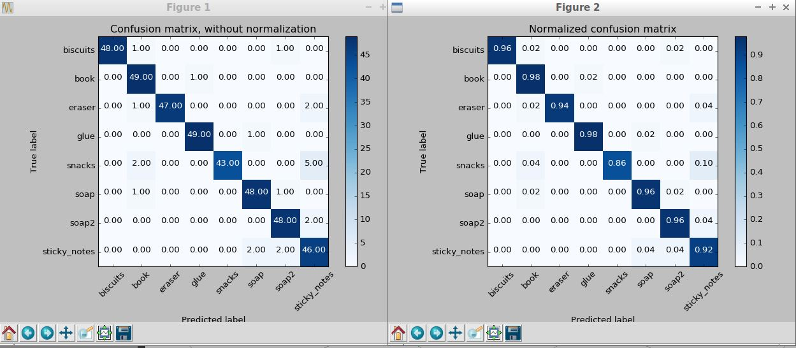

Writeup Report for RoboND - L.5. Project: 3D Perception Pick & Place  
By: David, Dong  
Udacity username: david.dong@psi-maker.com  
Date: Nov. 12, 2017  
Location: Beijing, China  

---
# Knowledge conclusion

1. Hardware 
 * A tensor processing unit (TPU) is an application-specific integrated circuit (ASIC) developed by Google specifically for machine learning. Compared to a graphics processing unit, it is designed explicitly for a higher volume of reduced precision computation (e.g. as little as 8-bit precision[1]) with higher IOPS per watt, and lacks hardware for rasterisation/texture mapping. such as Google Tensor Processing Unit (TPU)
 * the NVIDIA Drive PX2:AI Car computer for autonomous driving   
 * Active sensors: Laser Range Finder (Lidar), Time of Flight camera, Ultrasonic sensor...  
 * Passive sensors: Monocular camera, Stereo Camera...  
 * Hybrid sensors: RGB-D Cameras...  
2. Data processing    
 > 1) OpenCV can be used for Calibration RGB image pattern, it is the 3D to 2D calculation (http://wiki.ros.org/openni_launch/Tutorials/ExtrinsicCalibration)  
 > 2) Usually we get the 3D point clouds data (spatial information) from RGB-D camera and use Point Cloud Library-PCL(http://pointclouds.org/) to manipulate it. The RGB-D calibration method - image_pipeline http://wiki.ros.org/image_pipeline    
   >> * **Outlier Removal Filter**: takes care of distortion, noise by statistical outlier filter  
   >> * **Voxel Grid Downsampling**: Downsampling Filter to derive a point cloud that has fewer points but should still do a good job of representing the input point cloud as a whole. The important parameter is 'LEAF_SIZE'  
   >> * **Pass Through Filtering**:  a cropping tool, which allows you to crop any given 3D point cloud by specifying an axis with cut-off values along that axis. The region you allow to pass through, is often referred to as region of interest.  
     
 > 3) Point cloud segmentation
   >> * **RANSAC**(Random Sample Consensus-https://en.wikipedia.org/wiki/Random_sample_consensus) segmentation: use to identify points that belong to a particular model by Hypothesis and Verification. The important parameter is 'max_distance'  
   >> * **Clustering**: Isolate points cloud data into object by DBSCAN and k-means algorithm. The important parameters are ClusterTolerance, MinClusterSize, & MaxClusterSize  
     
 > 4) Object recognition 
   >> * Define the **features** for objects, such as Color histograms, Surface normal histograms, etc.   
   >> * **Support Vector Machine-SVM**: Supervised machine learning algorithm to characterize the parameter space of dataset into discrete classes. The important parameters for sklearn package are Kernal, C & Gamma  
     
 > 5) Use SVM to train data
   >> * At first we need use color histograms & surface normal histograms to get .sav classifier  
   >> * then we get confusion matrix(model.sav) to train the classifier  
   >> * at last we use the classifier to lable the isolated objects 
3. PR2 3D perception workflow  
 > * Get RGB-D camera data by PR2  
 > * Recognize objects by filters, clustering & segmentation  
 > * Generate necessary centroid message to response pick and place request, and output the message information to yaml files  
 > * Publish the point cloud to 3D_map avoiding arm collisions(not done yet, will do it later)  
 > * Publish joint angles to a topic finishing pick and place operation(not done yet, will do it later) 
4. Library & tools for perception domination  
 * K-means clustering: https://www.naftaliharris.com/blog/visualizing-k-means-clustering/  
 * DBSCAN Algorithm(sklearn.cluster) clustering  
 * RGB color, HSV color histograms, surface normal histograms for objects' feature  
 * Decision tree, SVM for recognize training (https://www.udacity.com/course/intro-to-machine-learning--ud120)
 * sklearn library
5. Useful links  
 * Demosaicing: https://en.wikipedia.org/wiki/Demosaicing  
 * Color filter array: https://en.wikipedia.org/wiki/Color_filter_array  
 * Image sensor: https://en.wikipedia.org/wiki/Image_sensor  
 * Moveit: https://classroom.udacity.com/nanodegrees/nd209/parts/7b2fd2d7-e181-401e-977a-6158c77bf816/modules/8855de3f-2897-46c3-a805-628b5ecf045b/lessons/91d017b1-4493-4522-ad52-04a74a01094c/concepts/c656a6e1-c31f-43c8-bff8-668fa412d74a
 
 
# The workflow and coding memo for perception pipeline exercise
---  
**Document descripton: (pr2_test1.py; pr2_test2.py; pr2_test3.py) are Python code files, which use the classifier and confusion matrix(model_test1.sav; model_test2.sav; model_test3.sav) to implement 3D perception pipeline & output to yaml files(output_1.yaml; output_2.yaml; output_3.yaml)**  
  
I used pr2_test3.py to explain below exercise workflow.  

---  
  
> main function of pr2_test3.py
  >> * Create point cloud '/pr2/world/points'
  >> * Create two publishers: '/pcl_camera' for RGB-D point cloud; '/object_markers' to label isolated objects
  >> * Loaded the classifier sav file  
  
> pcl_callback() function of pr2_test3.py  
  >> Implement perception pipeline, Classify the clusters and Publish the labels into RViz for exercise 1,2,3 

> pr2_mover() function of pr2_test3.py  
  >> * Get all request parameters into output yaml file  
  >> * Insert all message variables to be sent as a service request for pick_place_routine  

## Exercise 1 steps. Pipeline for filtering and RANSAC plane fitting implemented.
**pcl_callback() Coding details**  
1. Noise filter: fil.set_mean_k(50), the small value because of small object; fil.set_std_dev_mul_thresh(0.01) the value is about the Voxel Grid Downsampling leaf_size  
2. Voxel Grid Downsampling filter: for exercise 1,2, it is OK of leaf_size = 0.01, but for exercise 3, I set it to 0.008 to well identify the white glue object  
3. PassThrough Filter: assign y & z filter to ignore place boxes on side 
4. RANSAC Plane Segmentation: max_distance = 0.015 can ignore the table and keep all objects
  
## Exercise 2 steps: Pipeline including clustering for segmentation implemented.  
**pcl_callback() Coding details**   
1. Euclidean Clustering: ec.set_ClusterTolerance(0.02); ec.set_MinClusterSize(120); ec.set_MaxClusterSize(1500) can segment mess object one by one in this case  
2. It is not necessary to color objects in this case  

## Exercise 3 Steps.  Features extracted and SVM trained.  Object recognition implemented.
**pcl_callback() Coding details**  
1. Feature classifier: set color bin and surface normal bin equal to 32 in order to get the consistent result for SVM training  
2. Made the prediction, retrieve the label for all object  
3. Pass detected objects in pr2_move() function to output yaml file, parameters for pick and place service  
  
---
**Below is my SVM training optimization for reference**  
  
* use capture_features.py to generate training_set.sav file containing the features and labels for the dataset
* use train_svm.py to train the model, and have model.sav file for object recognition   
* optimization trining times; color models; histogram bins to find the best training value  

 5 times random orientation, RGB model, not optimize color and normal histograms parameter:  
    
 
add color and surface normal histogram function without bins set in fetures.py, RGB model, 5 times random orientation 
    
   

* computer fetures for 20 tiems of random orientation
* convert RGB to HSV  
  
  
* computer fetures for 50 tiems of random orientation
* convert RGB to HSV  
* bins=32, range=(0, 256) for HSV histograms; bins=32 for surface normals historgrams   
   
  
* computer fetures for 100 tiems of random orientation
* convert RGB to HSV  
* bins=32, range=(0, 256) for HSV histograms; bins=32 for surface normals historgrams   
   

**Conclusion: Balance the speed and accuracy, following parameters will be OK for this case**
* HSV model
* times = 50 random orientation  
* color and surface normal bins = 32

## Pick and Place implementation
**pr2_mover() function of pr2_test3.py**  
1. Loop through the pick list from pick_list confige file  
2. Get the ROS PointCloud for a given object and obtain it's centroid etc.
3. Output to yaml files
4. Insert message variables to be sent as a service request for pick_place_routine

**PR2_robot test1.world correctly identify 100%**
* computer fetures for 50 tiems of random orientation
* convert RGB to HSV  
* bins=32, range=(0, 256) for HSV histograms; bins=32 for surface normals historgrams   
 
  
  
Perception pipeline last result
  
  
  
**PR2_robot test2.world correctly identify 100%**
* computer fetures for 50 tiems of random orientation
* convert RGB to HSV  
* bins=32, range=(0, 256) for HSV histograms; bins=32 for surface normals historgrams   
 
  
  
Perception pipeline last result
  
  
  
**PR2_robot test3.world correctly identify 87%**
* computer fetures for 50 tiems of random orientation
* convert RGB to HSV  
* bins=32, range=(0, 256) for HSV histograms; bins=32 for surface normals historgrams   
 
  
  
Perception pipeline last result
  

# Key point conclusion for future improvement
1. The filters' parameter discussed above are very important for Support Vector Machine. Review (https://www.udacity.com/course/intro-to-machine-learning--ud120) carefully in future improvement
2. Review the filters knowledge per above hyperlink is needed
3. Balance the speed and accuracy is important for some projects, which need me familiar with the filters' mechanism
4. Conclude python library packages to efficiently implement SVM

# To be implemented in future
Becuase of time reason, following chanllenges havn't been finished, I list it here to remind me finish it in future. Detailed information refer to file 'to be continue.pdf' 
1. To create a collision map, avoid arm collision for pick & place
2. Rotate the robot to generate collision map of table sides
3. Rotate robot back to its original state
4. Create a ROS client for pick_place_routine rosservice(request-response)
5. Pick all the objects from pick list and dropoff to related group box
6. Perception implement for 'challenge.world'
