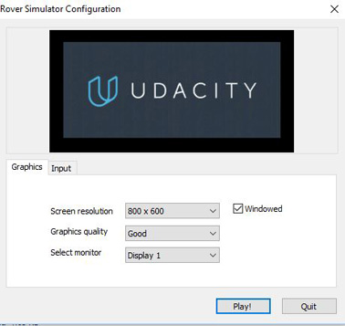

# RobotND
This is the resource and project submission for Udacity Robot Nano Degree 

The project submission document is categorised by folder name, e.g. L2-SSR_Submission-CN_DavidD means:
Lesson 2 - Search & Sample Return Project document submitted by David, Dong

The README.MD file in each folder will be the start page for that lesson. 

# Project environment
1. Windows 10 Pro English version
2. Download [Windows Simulator Build](https://s3-us-west-1.amazonaws.com/udacity-robotics/Rover+Unity+Sims/Windows_Roversim.zip)
3. Open Simulator by
 - *Screen resolution: 800 x 600*
 - *Graphic quality: Good*
 - *Display 1*  
 